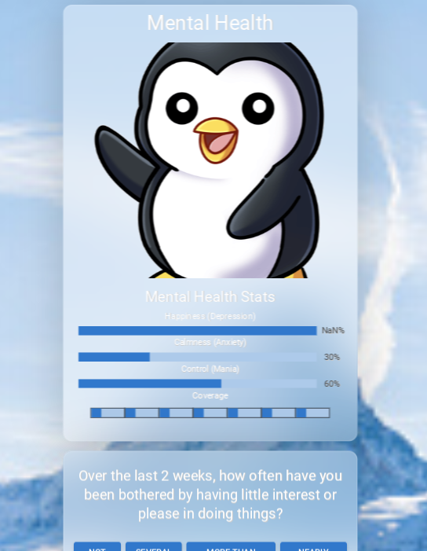
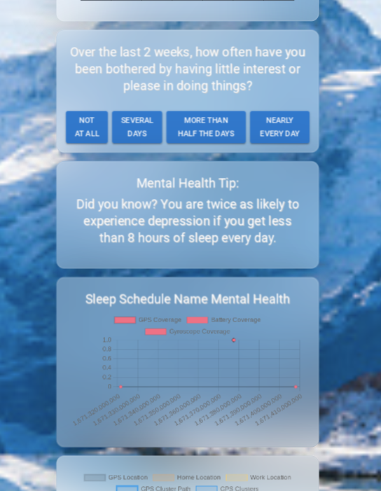
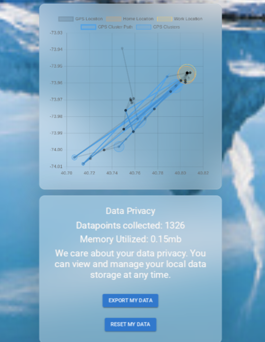
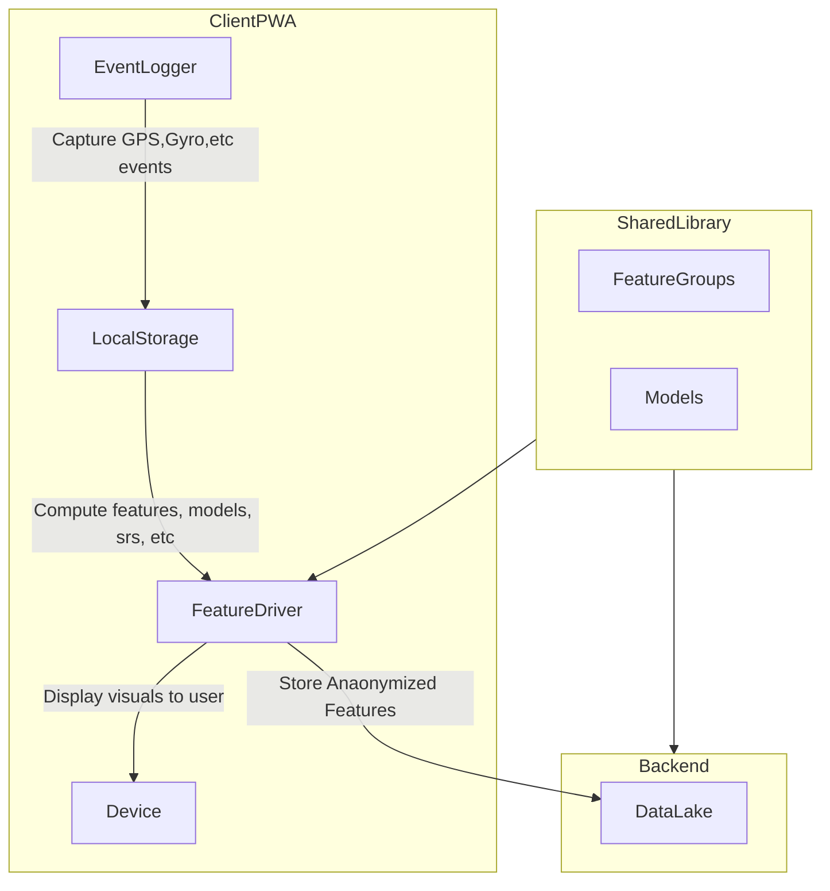

# Open Sourcing Mental Health
Passively tracking your behaviors using phone sensors

MHA protects you by ensuring all personal data and calculations are performed on the device. Using Questionaires and Passive sensing, MHA can compute your mental health state, and make recommendations to improve your health!

## Download
MHA is an open source web app, which can be install at https://zclarke.dev/mha





## Interested in using MHA for a research or clinical study?
MHA can be used in a variety of research and clinical settings in order to assess patient mental health, and compute statistics around patient populations. 

## Architecture
MHA focuses on privacy and data efficiency by running all computations on device. There are shared feature groups that can be used to compute features on both the frontend and backend using NodeJS. Only anonymized high level features- ie sleep are uploaded from the device to the backend. All business logic and calculations around app behavior are controlled through feature groups.



### Sensors
[Web API Sensors Available](https://developer.mozilla.org/en-US/docs/Web/API/Sensor_APIs)
Currently using:
- GPS
- Gyroscope
- Battery


## Source Code

### Install
```
yarn install
yarn run
```

### Deploy
```
yarn run deploy
```
